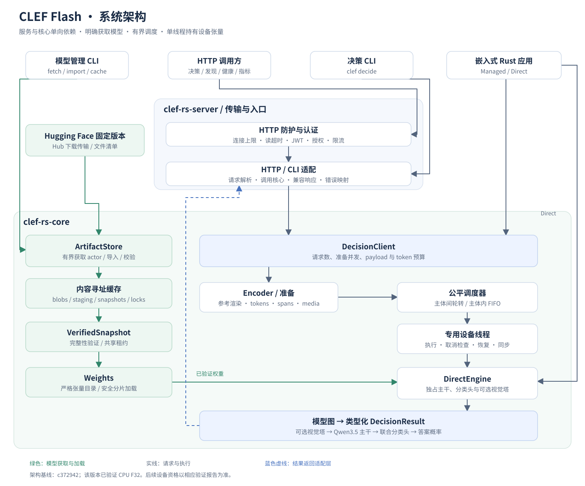
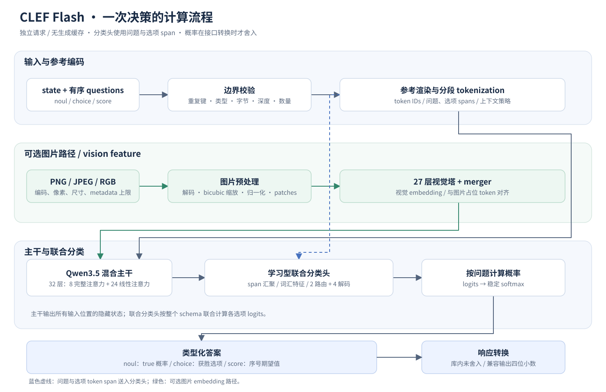

# CLEF Flash 代码与架构说明

本文以已提交的 Flash 实现 `c372942` 为架构基线，说明系统分层、推理流程，以及各 crate、源码、测试夹具和配置文件的职责。Metal 支持与性能 benchmark 正在后续工作中演进，其支持状态和测量结果应以对应的最新验证报告为准；本文不将尚未完成的资格验证写成已验证能力。

该基线支持 CPU F32、最多 4,096 个总输入 token，以及通过 `vision` feature 开启的 PNG/JPEG/RGB 图片输入。它直接用学习型联合分类头计算 `noul`、`choice`、`score` 答案概率，生产推理不依赖 Python。

## 1. 整体架构

[查看完整 SVG](images/clef-system-architecture.svg)

系统包含两个 crate：`clef-rs-server` 负责用户入口、配置与传输，`clef-rs-core` 负责模型获取、输入编码、推理及运行时管理。依赖方向为 **server → core**，核心库不依赖 HTTP、JWT 或服务端配置。

关键边界如下：

- **模型获取与推理分开**：模型获取是明确的管理操作，加载和推理不会临时下载文件。
- **所有入口共用核心**：HTTP 和 CLI 使用相同的编码、模型与答案转换逻辑。
- **模型张量由单个执行者持有**：服务模式下，专用设备线程独占模型，调用方通过有界通道提交任务。
- **资源在工作真正结束后释放**：请求取消后，仍在执行或准备中的工作继续持有相关资源预留。
- **参考 Python 只参与验证**：生产运行不会执行下载的模型源码，也没有 Python 推理服务。

### 1.1 模型获取与加载

`ArtifactStore` 根据固定版本的文件清单获取或导入模型，校验文件大小和摘要后，将文件存入内容寻址缓存，并原子发布完整快照。`VerifiedSnapshot` 持有共享租约，防止正在使用的快照被清理。

加载时，`Weights` 按预期的张量名称、shape、dtype 和分片位置检查 safetensors，再将权重组装为主干、联合分类头及可选视觉塔。模型目录中的 Python 和模板文件用于来源记录，不作为生产代码执行。

### 1.2 请求调度与模型所有权

服务和 CLI 决策通过 `DecisionClient` 提交请求，依次经过资源准入、编码准备和队列调度；调度器在调用主体之间轮转，在同一主体内部保持 FIFO。

`Runtime` 拥有调度器和设备线程，负责加载、预热、关闭准入、取消排队任务、等待执行完成及回收线程。设备线程中的 `DirectEngine` 持有模型张量。本文的原始基线每次决策独立执行；新增的 [精确文本前缀复用](clef-flash-prefix-reuse.md) 可显式保存有容量和寿命限制的前缀状态，并按调用主体隔离，默认库配置仍关闭缓存。

嵌入式调用方可以选择两种方式：直接使用同步的 `DirectEngine`，自行管理调用线程；或使用 `Runtime`/`DecisionClient`，复用受控准入和调度机制。

| 类型 | 职责 |
| --- | --- |
| `ExecutionProfile` | 指定设备、精度、模态、上下文上限和内存预算。 |
| `MemoryPlan` | 表达加载与执行所需的保守内存估计。 |
| `DirectEngine` | 在所属线程上持有模型张量并执行同步推理。 |
| `Runtime` | 拥有调度器和设备线程，管理启动、预热、恢复与关闭。 |
| `DecisionClient` | 提供可克隆的提交入口，持有通道和资源信号量，不持有模型张量。 |
| `DecisionOptions` | 为单次请求指定调用主体和截止时间。 |
| `ShutdownReport` | 报告运行时是否成功完成执行排空与关闭。 |

## 2. 一次决策如何完成

[查看完整 SVG](images/clef-inference-flow.svg)

1. **输入校验**：解析 `state` 和有序 `questions`，检查类型、重复键、字节长度、深度、集合数量及语义限制。
2. **参考编码**：按固定格式渲染输入，分别 tokenize 各段，保存问题指令与选项的半开 token span；默认拒绝上下文溢出，只有明确配置时才截断 state 前缀。
3. **可选图片处理**：解码并校验 PNG/JPEG/RGB 输入，执行参考一致的缩放、归一化、patch 排列和图片 token/多轴位置编码；视觉塔输出进入对应的文本 embedding 位置。
4. **主干计算**：Flash 的 Qwen3.5 主干包含 32 层，其中 8 层完整注意力、24 层线性注意力，输出全部输入位置的隐藏状态。
5. **联合分类**：分类头根据 token span 汇聚问题与选项语义，结合输出 embedding 的词汇特征，通过证据路由和联合解码计算各选项的 logits。
6. **答案转换**：对每个问题计算概率分布，再生成对应类型的答案；库内保留未舍入概率，兼容响应转换时再保留四位小数。

| 问题类型 | 输出语义 |
| --- | --- |
| `noul` | 返回 true 的概率。 |
| `choice` | 返回获胜选项、置信度及完整选项分布，精确并列时按调用方原始选项顺序选择。 |
| `score` | 返回选项序号的期望值、置信度、原始 legend 及完整概率分布。 |

图片路径包含 27 层视觉 Transformer 和 merger。联合分类头包含两层证据路由和四层联合解码；即使没有生成 token，也会使用 `lm_head` 的 embedding 行构造词汇特征。

## 3. 两个 crate

| Crate | 一句话介绍 |
| --- | --- |
| [`clef-rs-core`](../crates/core/Cargo.toml) | 提供可嵌入的模型获取、校验、编码、推理与受控运行时，不依赖 HTTP 服务层。 |
| [`clef-rs-server`](../apps/server/Cargo.toml) | 将核心能力包装成 `clef` CLI 和经过认证、授权、限流的 Axum HTTP 服务。 |

## 4. 核心源码：`crates/core/src/`

| 文件 | 一句话介绍 |
| --- | --- |
| [`lib.rs`](../crates/core/src/lib.rs) | 声明公共模块、导出主要 API，并禁止项目 Rust 使用 unsafe。 |
| [`types.rs`](../crates/core/src/types.rs) | 定义经过校验的请求、问题、标识符、概率和答案，以及概率到兼容响应的转换规则。 |
| [`encoding.rs`](../crates/core/src/encoding.rs) | 复现参考实现的 JSON 渲染、分段 tokenization、问题/选项 span、截断和图片位置编码。 |
| [`runtime.rs`](../crates/core/src/runtime.rs) | 实现执行配置、内存规划、同步引擎、有界准入、公平调度、设备线程、恢复与关闭。 |
| [`media.rs`](../crates/core/src/media.rs) | 校验并解码图片，执行与参考实现一致的缩放、归一化和 patch 排列。 |
| [`error.rs`](../crates/core/src/error.rs) | 定义获取、完整性、输入、资源、超时和推理等领域错误，并保留错误来源。 |
| [`artifacts/mod.rs`](../crates/core/src/artifacts/mod.rs) | 管理固定模型清单、获取 actor、内容寻址缓存、原子发布、导入、校验及租约保护的清理。 |
| [`artifacts/hub.rs`](../crates/core/src/artifacts/hub.rs) | 实现受限 HTTPS 下载、公共 IP 校验与固定、凭证隔离、断点续传、重试和超时。 |
| [`artifacts/clef-flash-catalog.json`](../crates/core/src/artifacts/clef-flash-catalog.json) | 保存 Flash 固定版本全部模型文件的名称、大小和完整性摘要。 |
| [`artifacts/clef-flash-tensors.json`](../crates/core/src/artifacts/clef-flash-tensors.json) | 保存全部预期张量的名称、shape、dtype 和所在分片，作为加载白名单。 |
| [`models/mod.rs`](../crates/core/src/models/mod.rs) | 组织私有模型模块，提供共同的取消/截止时间检查，并放置主干和分类头的参考对齐测试。 |
| [`models/weights.rs`](../crates/core/src/models/weights.rs) | 严格校验 safetensors 和张量目录，并将权重装配成模型层。 |
| [`models/ops.rs`](../crates/core/src/models/ops.rs) | 实现共享的归一化、分块稳定注意力、旋转位置编码和多头注意力算子。 |
| [`models/qwen.rs`](../crates/core/src/models/qwen.rs) | 实现 Flash 的 Qwen3.5 主干，包括完整注意力、因果卷积、门控 Delta 递推和前馈网络。 |
| [`models/head.rs`](../crates/core/src/models/head.rs) | 实现学习型联合分类头，包括 span 汇聚、词汇先验、证据路由、联合解码和最终 logits。 |
| [`models/vision.rs`](../crates/core/src/models/vision.rs) | 实现视觉 patch 投影、位置插值、视觉 Transformer 和向文本空间输出的 merger。 |

## 5. 服务源码：`apps/server/src/`

| 文件 | 一句话介绍 |
| --- | --- |
| [`main.rs`](../apps/server/src/main.rs) | 定义 CLI 命令，组装配置、模型运行时和 HTTP 服务，并处理退出信号。 |
| [`config.rs`](../apps/server/src/config.rs) | 安全解析 YAML、应用明确允许的环境覆盖，并校验配置之间的约束。 |
| [`auth.rs`](../apps/server/src/auth.rs) | 使用本地 RS256 JWKS 验证访问令牌，并检查 scope 和模型访问权限。 |
| [`listener.rs`](../apps/server/src/listener.rs) | 限制 TCP 连接数和空闲读时间，同时保护正在执行推理的连接。 |
| [`routes.rs`](../apps/server/src/routes.rs) | 实现认证中间件、主体限流、决策、模型发现、健康检查和受保护的指标端点。 |
| [`error.rs`](../apps/server/src/error.rs) | 将核心错误映射为稳定 HTTP 状态、脱敏错误消息和请求 ID。 |
| [`../fixtures/README.md`](../apps/server/fixtures/README.md) | 说明测试签名密钥的来源和测试用途。 |
| [`../fixtures/test-rsa-private.der`](../apps/server/fixtures/test-rsa-private.der) | 提供公开的测试专用 RSA 私钥，用于生成认证测试令牌。 |

### HTTP 接口

| 接口 | 用途 |
| --- | --- |
| `POST /v1/systemone` | 提交决策请求。 |
| `GET /v1/models` | 查看调用方有权限访问的模型和执行配置。 |
| `GET /livez` | 查看服务存活状态。 |
| `GET /readyz` | 查看模型是否完成预热并接受请求。 |
| `GET /metrics` | 获取经过认证的 Prometheus 指标。 |

所有接口均要求认证，决策与观测分别需要对应的 scope，决策还必须满足模型授权。认证使用本地公钥快照，不在请求期间访问远程身份服务。

## 6. 示例与参考验证代码

| 文件 | 一句话介绍 |
| --- | --- |
| [`examples/clef.cpu.yaml`](../examples/clef.cpu.yaml) | 提供完整的 Flash CPU 配置，包括缓存、执行预算、队列、HTTP 和认证设置。 |
| [`examples/request.json`](../examples/request.json) | 提供同时包含三种问题类型的示例请求。 |
| [`crates/core/examples/decision.rs`](../crates/core/examples/decision.rs) | 演示嵌入式应用如何从本地已验证缓存加载 Flash 并执行决策。 |
| [`crates/core/examples/README.md`](../crates/core/examples/README.md) | 说明嵌入式示例的用途。 |
| [`tests/reference/generate.py`](../tests/reference/generate.py) | 用固定参考实现生成小规模算子、模型、编码和图片位置的黄金夹具。 |
| [`tests/reference/qualify_flash.py`](../tests/reference/qualify_flash.py) | 使用真实 Flash 权重生成未舍入的完整模型参考概率。 |
| [`tests/reference/serve_smoke.py`](../tests/reference/serve_smoke.py) | 启动真实 CLI/HTTP 服务，检查认证、图片推理、参考概率、接口一致性和 SIGTERM 关闭。 |
| [`tests/reference/requirements.lock`](../tests/reference/requirements.lock) | 固定 Python 参考验证环境的依赖版本。 |

Rust 单元测试大多直接放在对应源码的 `#[cfg(test)]` 模块内；需要大内存和真实权重的测试通过 `#[ignore]` 与普通 CI 分开。

## 7. 测试数据：`crates/core/fixtures/`

| 文件 | 一句话介绍 |
| --- | --- |
| [`README.md`](../crates/core/fixtures/README.md) | 说明该目录保存测试夹具。 |
| [`release/flash-f32.json`](../crates/core/fixtures/release/flash-f32.json) | 保存 100 个真实 Flash 文本/JSON 请求的参考概率。 |
| [`release/flash-extended-f32.json`](../crates/core/fixtures/release/flash-extended-f32.json) | 保存完整 4,096-token 上下文和两种 PNG 图片的参考结果。 |
| [`release/flash-jpeg-f32.json`](../crates/core/fixtures/release/flash-jpeg-f32.json) | 保存 baseline 和 progressive JPEG 的完整模型参考结果。 |
| [`synthetic/provenance.json`](../crates/core/fixtures/synthetic/provenance.json) | 记录生成小模型夹具的参考来源和环境信息。 |
| [`synthetic/encoding.json`](../crates/core/fixtures/synthetic/encoding.json) | 保存渲染、token ID 和问题/选项 span 的准确参考结果。 |
| [`synthetic/backbone-config.json`](../crates/core/fixtures/synthetic/backbone-config.json) | 定义用于快速验证混合主干的小模型配置。 |
| [`synthetic/backbone.safetensors`](../crates/core/fixtures/synthetic/backbone.safetensors) | 保存小规模混合主干的测试权重。 |
| [`synthetic/backbone-output.safetensors`](../crates/core/fixtures/synthetic/backbone-output.safetensors) | 保存小规模主干的参考输出。 |
| [`synthetic/head-config.json`](../crates/core/fixtures/synthetic/head-config.json) | 定义小规模联合分类头的配置。 |
| [`synthetic/head.safetensors`](../crates/core/fixtures/synthetic/head.safetensors) | 保存联合分类头的测试权重。 |
| [`synthetic/head-input.safetensors`](../crates/core/fixtures/synthetic/head-input.safetensors) | 保存分类头测试所需的输入和参考张量。 |
| [`synthetic/vision-config.json`](../crates/core/fixtures/synthetic/vision-config.json) | 定义小规模视觉模型的配置。 |
| [`synthetic/vision.safetensors`](../crates/core/fixtures/synthetic/vision.safetensors) | 保存视觉塔和 merger 的测试权重。 |
| [`synthetic/image-256-256.json`](../crates/core/fixtures/synthetic/image-256-256.json) | 保存方形图片测试的尺寸及相关描述。 |
| [`synthetic/image-256-256.rgb`](../crates/core/fixtures/synthetic/image-256-256.rgb) | 保存方形图片的原始 RGB 像素。 |
| [`synthetic/image-256-256.safetensors`](../crates/core/fixtures/synthetic/image-256-256.safetensors) | 保存方形图片的 patch 与视觉参考张量。 |
| [`synthetic/image-37-61.json`](../crates/core/fixtures/synthetic/image-37-61.json) | 保存非方形图片测试的尺寸及相关描述。 |
| [`synthetic/image-37-61.rgb`](../crates/core/fixtures/synthetic/image-37-61.rgb) | 保存非方形图片的原始 RGB 像素。 |
| [`synthetic/image-37-61.safetensors`](../crates/core/fixtures/synthetic/image-37-61.safetensors) | 保存非方形图片的 patch 与视觉参考张量。 |
| [`synthetic/image-37-61.jpg`](../crates/core/fixtures/synthetic/image-37-61.jpg) | 提供 JPEG 解码一致性和变异测试的输入样本。 |
| [`synthetic/image-37-61-jpeg.rgb`](../crates/core/fixtures/synthetic/image-37-61-jpeg.rgb) | 保存该 JPEG 经 Pillow 解码后的预期 RGB 像素。 |
| [`synthetic/media-positions.json`](../crates/core/fixtures/synthetic/media-positions.json) | 保存多图片输入的多轴旋转位置编码参考坐标。 |

这些文件包含小模型、输入样本或黄金结果；约 19 GB 的真实模型权重保存在外部缓存，不进入 Git。

## 8. 构建、配置与仓库文件

| 文件 | 一句话介绍 |
| --- | --- |
| [`Cargo.toml`](../Cargo.toml) | 定义 workspace、共享依赖、Rust edition 和统一 lint 策略。 |
| [`Cargo.lock`](../Cargo.lock) | 固定实际解析的 Rust 依赖版本。 |
| [`crates/core/Cargo.toml`](../crates/core/Cargo.toml) | 定义核心库依赖及 `hub`、`vision`、`cuda`、`metal` features。 |
| [`apps/server/Cargo.toml`](../apps/server/Cargo.toml) | 定义 `clef` 二进制、服务端依赖及向核心传递的 features。 |
| [`rust-toolchain.toml`](../rust-toolchain.toml) | 固定 Rust 工具链和所需组件。 |
| [`Makefile`](../Makefile) | 集中提供构建、验证、参考结果生成、原生 JPEG 构建和媒体 fuzz 命令。 |
| [`.cargo/config.toml`](../.cargo/config.toml) | 指定经过校验的 libjpeg-turbo 静态库及头文件位置。 |
| [`.github/workflows/build.yml`](../.github/workflows/build.yml) | 在 Linux/macOS 执行快速构建验证，并单独检查依赖安全与许可证政策。 |
| [`deny.toml`](../deny.toml) | 配置依赖来源、许可证和安全公告检查规则。 |
| [`clippy.toml`](../clippy.toml) | 配置项目的 Clippy 检查规则。 |
| [`rustfmt.toml`](../rustfmt.toml) | 配置 Rust 自动格式化规则。 |
| [`.pre-commit-config.yaml`](../.pre-commit-config.yaml) | 定义提交前检查工具。 |
| [`.gitignore`](../.gitignore) | 排除构建产物、模型缓存、参考环境和原生 SDK 等本地产物。 |
| [`.tokeignore`](../.tokeignore) | 配置代码统计时忽略的文件。 |
| [`_typos.toml`](../_typos.toml) | 配置拼写检查的例外规则。 |
| [`cliff.toml`](../cliff.toml) | 配置 Git 提交到 changelog 的生成规则。 |
| [`CHANGELOG.md`](../CHANGELOG.md) | 保存版本变更记录。 |
| [`LICENSE.md`](../LICENSE.md) | 声明项目源码的 MIT 许可证。 |
| [`AGENTS.md`](../AGENTS.md) | 定义本仓库的开发、代码质量和验证要求。 |
| [`CLAUDE.md`](../CLAUDE.md) | 提供另一编码助手使用的仓库指导入口。 |
| [`README.md`](../README.md) | 介绍功能边界、快速运行方法和验证入口。 |

## 9. 设计、研究与操作文档

| 文件 | 一句话介绍 |
| --- | --- |
| [`specs/clef-serving-design.md`](../specs/clef-serving-design.md) | 定义模型获取、推理、服务、安全、生命周期和资格验证的完整目标设计。 |
| [`specs/index.md`](../specs/index.md) | 索引正式规格文档。 |
| [`specs/README.md`](../specs/README.md) | 提供规格目录的阅读入口。 |
| [`docs/index.md`](index.md) | 索引研究、操作说明、架构文档和验证报告。 |
| [`docs/clef-flash-architecture.md`](clef-flash-architecture.md) | 说明 Flash 的系统架构、推理流程和逐文件职责。 |
| [`docs/images/clef-system-architecture.svg`](images/clef-system-architecture.svg) | 展示模型获取、服务入口、缓存、运行时和模型所有权之间的关系。 |
| [`docs/images/clef-inference-flow.svg`](images/clef-inference-flow.svg) | 展示文本/图片输入到联合分类和类型化答案的计算流程。 |
| [`docs/clef-flash-usage.md`](clef-flash-usage.md) | 说明实际可用的 CLI、配置、缓存、认证、请求格式、图片和关闭行为。 |
| [`docs/clef-flash-verification.md`](clef-flash-verification.md) | 记录真实权重验证结果、数值误差、内存观测、已执行检查及资格限制。 |
| [`docs/research/index.md`](research/index.md) | 索引研究记录。 |
| [`docs/research/clef-candle-research.md`](research/clef-candle-research.md) | 记录上游模型结构、固定版本、参考算法和依赖调研。 |
| [`docs/research/clef-flash-implementation-research.md`](research/clef-flash-implementation-research.md) | 记录实现过程中发现的 resize、JPEG、下载来源和依赖兼容问题。 |
| [`docs/licenses/index.md`](licenses/index.md) | 汇总可选原生 JPEG 功能的分发许可证要求。 |
| [`docs/licenses/libjpeg-turbo-LICENSE.md`](licenses/libjpeg-turbo-LICENSE.md) | 保留 libjpeg-turbo 的许可证说明。 |
| [`docs/licenses/README.ijg`](licenses/README.ijg) | 保留 Independent JPEG Group 的许可与署名要求。 |
| [`docs/licenses/turbojpeg-LICENSE`](licenses/turbojpeg-LICENSE) | 保留 Rust turbojpeg binding 的 MIT 许可证。 |

## 10. 相关操作与验证入口

- 运行、配置和接口细节：[Flash 使用与运维](clef-flash-usage.md)。
- 已执行的正确性检查与数值结果：[Flash 验证报告](clef-flash-verification.md)。
- 完整目标、后续平台和资格要求：[系统设计](../specs/clef-serving-design.md)。

基线中的正确性测试包含耗时和部分内存观测，但没有独立性能 benchmark；这些记录不能替代不同 CPU/Metal 配置下的加载、延迟、吞吐量、并发及内存性能测量。
