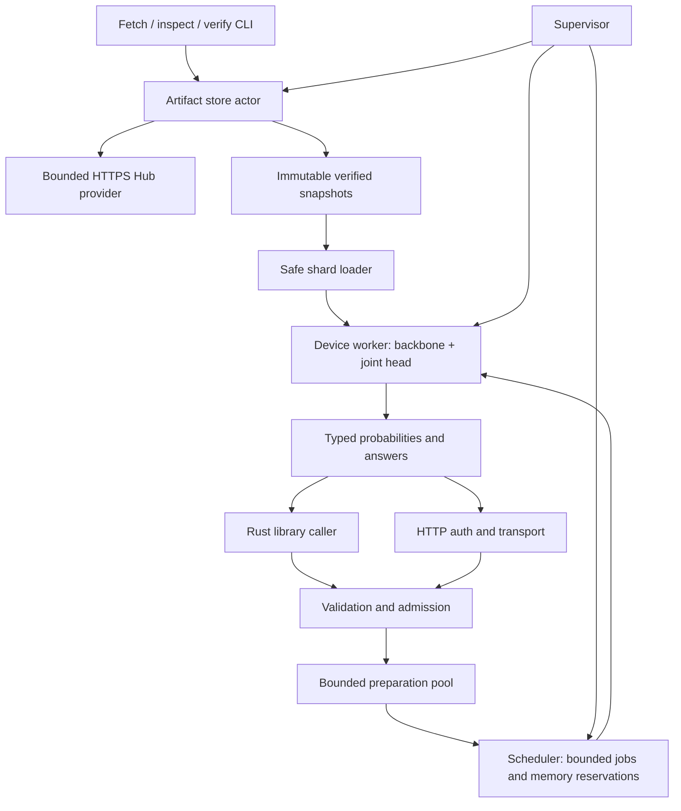
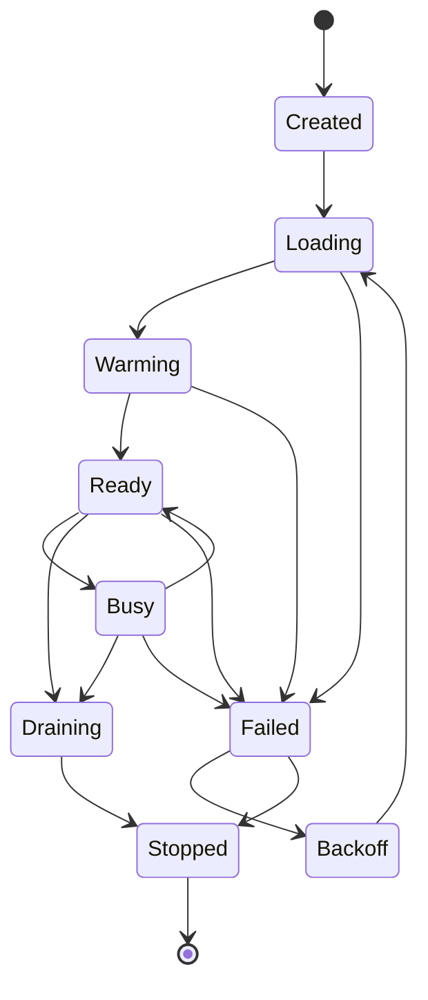

# CLEF download and inference system design

Status: proposed implementation specification. Date: 2026-10-01.

This specification defines a Rust library and HTTP server that download and run Cloudflare's CLEF decision models using Hugging Face Candle. It specifies the complete target system and independently releasable milestones. It does not claim that model execution, compatibility, or performance has already been demonstrated in this repository.

## 1. Decision and scope

Build one inference engine, exposed through `clef-rs-core`, with `clef-rs-server` as its HTTP and CLI adapter. Separate model acquisition from inference: callers can explicitly download a verified snapshot, load it without networking, and make decisions repeatedly. Production servers load pinned snapshots before becoming ready; inference never triggers an on-demand download.

CLEF is a schema-conditioned classifier. Its result comes from a Qwen backbone and a learned joint schema head, not generated JSON or vocabulary-token log probabilities. Candle supplies tensors, device execution, and neural network building blocks; this project must implement the released backbone architecture and decision head where Candle lacks them. Preserve the released algorithm before optimizing it. [Cloudflare announcement](https://blog.cloudflare.com/clef-decision-models/), [released inference source](https://huggingface.co/Cloudflare/clef/blob/2f3de3dd85f379784083b0814d997ab627200f0c/joint_schema_model.py).

The target includes both released models; text and bounded JSON state; all three question types; CPU, CUDA, and subsequently qualified Metal execution; library and server modes; offline operation; reliable download/cache management; image inference; observability; and controlled lifecycle management. Video frame inference is a separate capability milestone with an explicit contract. No training, reinforcement learning, arbitrary Python execution, generic chat completion, tool execution, browser fetching, or automatic model selection is included. The service returns decisions; the application owns any resulting action.

### Success criteria

1. A user can fetch either official release, verify it, load it from local storage, and obtain typed decisions through the library and the server.
2. Accepted requests have exactly the same encoding and decision semantics in both interfaces. Numerical differences against the pinned Python implementation meet the parity gates in section 15.
3. Offline mode performs no network operations, including metadata refresh, telemetry, and authentication key discovery.
4. Concurrent callers cannot create unbounded queues, duplicate model loads, overwrite published snapshots, or leak tensors or request state between decisions.
5. A release advertises only the model/device/dtype/modality/context combinations that pass qualification. Unsupported combinations fail explicitly.
6. No Rust code in this project requires `unsafe`, executes downloaded code, or panics on malformed input.

## 2. Verified release facts and compatibility boundary

Research and dependency versions are recorded in [the research record](../docs/research/clef-candle-research.md). The following identifiers refer to immutable Hugging Face snapshots observed on 2026-10-01, rather than floating `main` branches.

| Property | `clef-flash` | `clef` |
| --- | --- | --- |
| Repository | `Cloudflare/clef-flash` | `Cloudflare/clef` |
| Revision | `17f0b0ad64efb65d273590632833508766b2aae6` | `2f3de3dd85f379784083b0814d997ab627200f0c` |
| Model card backbone label | Qwen3.5-9B | Qwen3.8-27B |
| Executable configuration | `Qwen3_5ForConditionalGeneration`, `qwen3_5` | Same architecture identifiers |
| Backbone/vision parameters from index | 9,409,813,744 | 27,356,728,560 |
| Text width / layers | 4,096 / 32 | 5,120 / 64 |
| Full attention / linear attention layers | 8 / 24 | 16 / 48 |
| Full attention query heads / KV heads / head dimension | 16 / 4 / 256 | 24 / 4 / 256 |
| Linear key/value heads | 16 / 32 | 16 / 48 |
| Linear key/value dimensions / causal convolution width | 128 / 128 / 4 | Same |
| Joint head parameters | 121,762,820 | 128,056,324 |
| Head width / routing blocks / decoder blocks / heads / FFN width | 1,024 / 2 / 4 / 16 / 4,096 | Same |
| Backbone shards | 4 | 12 |
| Backbone + head files, excluding tokenizer and metadata | 19,063,259,136 bytes, 17.754 GiB | 54,969,731,792 bytes, 51.195 GiB |

Sources: pinned [Flash configuration](https://huggingface.co/Cloudflare/clef-flash/blob/17f0b0ad64efb65d273590632833508766b2aae6/config.json), [CLEF configuration](https://huggingface.co/Cloudflare/clef/blob/2f3de3dd85f379784083b0814d997ab627200f0c/config.json), and the respective [Flash Hub metadata](https://huggingface.co/api/models/Cloudflare/clef-flash/revision/17f0b0ad64efb65d273590632833508766b2aae6?blobs=true) and [CLEF Hub metadata](https://huggingface.co/api/models/Cloudflare/clef/revision/2f3de3dd85f379784083b0814d997ab627200f0c?blobs=true). Head parameter counts are calculated from the released safetensors headers; file sizes include those headers.

Do not select an implementation from marketing names. In particular, the larger model's Qwen3.8 label does not authorize using Candle's ordinary Qwen3 implementation. Both snapshots declare a hybrid `qwen3_5` architecture. The adapter validates each configuration against its supported architecture fingerprint before allocating weights.

Cloudflare describes a 64k context window; the released encoder defaults to 16,384 tokens, while model configuration permits 262,144 positions. These are distinct facts. Our initial default is 4,096 total encoded tokens; qualification can raise it to 16,384. A later long-context milestone may qualify 65,536. Never advertise 262,144 because a config field allows it. Published Cloudflare latency numbers are not local Candle performance targets. [Announcement](https://blog.cloudflare.com/clef-decision-models/), [release encoder](https://huggingface.co/Cloudflare/clef/blob/2f3de3dd85f379784083b0814d997ab627200f0c/joint_schema_model.py), [configuration](https://huggingface.co/Cloudflare/clef/blob/2f3de3dd85f379784083b0814d997ab627200f0c/config.json).

### Candle feasibility

Candle 0.11.0 includes Qwen2, Qwen3, and Qwen3-VL modules, but its published model module list does not include Qwen3.5 or CLEF. Existing modules are references for reusable operations, not interchangeable model implementations. Implement a safe tensor-operation port of the required Qwen3.5 architecture and joint head locally, with an upstream contribution possible after parity. The first implementation uses `candle-core` and `candle-nn`; adding `candle-transformers` requires actual reuse that justifies the dependency. [Candle 0.11.0 model modules](https://github.com/huggingface/candle/blob/0.11.0/candle-transformers/src/models/mod.rs).

Neither a Python subprocess nor a remote Workers AI call is an inference fallback. Those would change the deployment and privacy contract. Unknown architecture, missing operation, unavailable device, or failed parity prevents qualification.

## 3. Architecture and ownership



| Component | Responsibility | Owned state |
| --- | --- | --- |
| Boundary validator | Convert bytes/config/library values to valid domain objects | No model state |
| Artifact store actor | Resolve, download, verify, import, publish, inspect and prune snapshots | In-flight download table, leases, disk reservations |
| Preparation pool | Reference rendering, tokenization, media decoding and span extraction | Bounded tasks, tokenizer replicas, temporary byte buffers |
| Scheduler actor | Admission, deadlines, fairness, worker routing and reservations | Queues, worker status, request ownership |
| Device worker | Load and execute exactly one snapshot/profile | Candle device, model tensors, per-job scratch |
| Supervisor | Startup, drain, worker failure, restart and configuration publication | Join handles, lifecycle state, immutable routing generation |
| Server adapter | Authentication, authorization, HTTP errors and shutdown | HTTP listeners, immutable auth configuration |

Actors communicate using bounded Tokio `mpsc` and `oneshot` channels. The scheduler owns its maps; no concurrent-map dependency is necessary. Candle devices and tensors never live behind a shared `Mutex` or `RwLock`. A synchronous direct engine stays on its caller's thread. An async managed engine executes Candle calls on a dedicated OS thread per worker, initializes the device there, and releases it there. This also avoids depending on all device handles being `Send` or on backend thread affinity being interchangeable.

The existing workspace contains `crates/core` and `apps/server` with template code. Retain these packages and introduce focused modules rather than a collection of prematurely published crates:

```text
crates/core/src/
  lib.rs                 # curated public API
  error.rs               # domain errors
  types/                 # validated requests, probabilities, identifiers
  artifacts/             # catalog, Hub transport, manifests, store actor
  encoding/              # reference renderer, tokenizer, spans
  models/qwen3_5/        # hybrid text backbone and vision tower
  models/joint_head/     # evidence routing and joint decision head
  runtime/               # direct engine, scheduler, workers, supervision
  media/                 # qualified image/frame processing
apps/server/src/
  main.rs, cli.rs, config.rs, auth.rs, routes.rs, error.rs
```

Model implementation modules and Candle types remain private. The server depends on the public core API; it cannot maintain a second encoder or probability implementation. Abstract the artifact provider with a private native async trait for test substitution. Use concrete backend enums instead of dynamic dispatch until a demonstrated need arises.

## 4. Domain model and library contract

Public structures are non-exhaustive, implement `Debug` with payload/secret redaction where needed, and expose getters and fallible constructors. Configuration structures with more than five fields use `typed-builder`. `TryFrom`/`FromStr` implement validation for identifiers, revisions, ranges and raw requests. Library errors use `thiserror` and retain sources; application startup adds `anyhow` context.

| Type | Invariant and purpose |
| --- | --- |
| `ModelPreset` | Closed enum: `Clef`, `ClefFlash`; maps to reviewed repository and default immutable revision |
| `RepositoryId`, `CommitRevision`, `SnapshotId` | Validated owner/name, full 40-hex commit, and content identity; never inferred from inference state |
| `VerifiedSnapshot` | Constructible only by successful artifact verification; contains manifest identity and a store lease |
| `ExecutionProfile` | Qualified device, dtype, modality and context limits; explicit CPU, CUDA ordinal or Metal ordinal |
| `BoundedJson` | Valid UTF-8, finite numeric values, bounded depth/nodes/strings; domain state and semantic descriptions |
| `QuestionId`, `OptionId` | Unique, nonempty ASCII identifiers of at most 64 bytes |
| `Question` | Tagged enum: `Noul`, `Choice`, `Score`; distinct criteria types make invalid combinations impossible |
| `DecisionRequest` | Ordered, nonempty question collection; bounded state/media; a model alias is supplied only by the service adapter |
| `EncodedRecord` | Private token IDs and nonempty checked token spans; includes encoding profile and snapshot fingerprint |
| `Probability` | Finite `f32` in `[0,1]`; created only after checked per-question softmax |
| `DecisionResult` | Typed answers, unrounded distributions, token usage and immutable execution provenance |

`BoundedJson` may internally wrap `serde_json::Value` because user state and semantic descriptions are genuinely dynamic. Model configuration, manifests, question envelopes and responses are strongly typed. Ordered questions use a vector of validated entries; boundary parsing detects duplicate keys before converting them to this representation. Choice descriptions retain caller order separately from lexicographically ordered model options.

### Proposed public API

The following signatures describe the future API, not existing source code:

| Operation | Signature shape | Behavior |
| --- | --- | --- |
| Resolve and download | `ArtifactStore::fetch(source, policy) -> async Result<VerifiedSnapshot>` | Explicit online action; progress via a bounded receiver |
| Import local release | `ArtifactStore::import(path, expected_manifest) -> async Result<VerifiedSnapshot>` | Validate and copy into private immutable storage; reject untrusted path escapes |
| Inspect cache | `ArtifactStore::list() -> async Result<Vec<SnapshotInfo>>` | Bounded listing with pagination when needed |
| Direct load | `DirectEngine::load(snapshot, profile) -> Result<DirectEngine>` | Blocking, no network; load on the invoking thread |
| Direct decision | `DirectEngine::decide(&mut self, request) -> Result<DecisionResult>` | Blocking, single-owner execution |
| Managed start | `Runtime::start(snapshot, runtime_config) -> async Result<Runtime>` | Returns only after load, capability check and warmup |
| Concurrent decision | `DecisionClient::decide(request, options) -> async Result<DecisionResult>` | Cloneable handle; bounded admission, deadlines and cancellation |
| Managed stop | `Runtime::shutdown(deadline) -> async Result<ShutdownReport>` | Explicit drain and join; does not destroy the artifact cache |

The direct engine gives embedded applications control over threading without requiring a Tokio runtime for inference. Its download API still requires Tokio. Async callers use the managed client instead of invoking direct inference on an executor thread. Library configuration has the same hard caps as the server and may choose lower limits. Offline applications can compile with the `hub` feature disabled.

`Runtime` owns the supervisor and all worker joins; clients do not own model tensors. Dropping the owner signals stop and closes admission, while explicit shutdown provides completion guarantees. A direct engine does not promise interruption in the middle of a device kernel. All public fallible functions document errors, examples, lifetime rules and blocking behavior.

### Error taxonomy

Errors distinguish `InvalidRequest`, `UnsupportedArchitecture`, `UnsupportedCapability`, `ArtifactMissing`, `RevisionNotFound`, `DownloadFailed`, `IntegrityMismatch`, `StorageLimit`, `ModelLoadFailed`, `InsufficientMemory`, `QueueFull`, `DeadlineExceeded`, `Cancelled`, `InferenceFailed`, `WorkerUnavailable`, and `ShuttingDown`. Attach safe model/revision/stage context, never raw state, questions, credentials, signed URLs or filesystem paths in public HTTP errors. Preserve the underlying error for internal diagnostics without automatically formatting it into logs.

## 5. Reference encoding and inference algorithm

The compatibility authority is the pinned `joint_schema_model.py`, its head weights, and the release-tested Transformers 5.10.2 backbone implementation. Hugging Face's generic pipeline/chat examples are not the decision inference recipe. The encoder manually tokenizes prompt segments; applying a generic chat template once to a combined string can change tokens at segment boundaries and invalidate spans. [Released source](https://huggingface.co/Cloudflare/clef/blob/2f3de3dd85f379784083b0814d997ab627200f0c/joint_schema_model.py), [Transformers reference](https://github.com/huggingface/transformers/blob/v5.10.2/src/transformers/models/qwen3_5/modeling_qwen3_5.py).

### 5.1 Ordered encoding

1. Render strings directly. Render other JSON values compactly, with recursively sorted object keys and unescaped Unicode, following Python's `render` behavior. Preserve the distinction between JSON string content and JSON-serialized objects.
2. Traverse questions in their incoming object order. Missing, null, or empty-string instructions use the question ID. Other instructions are rendered as bounded JSON semantics.
3. `noul` options are always `true`, then `false`, with the reference descriptions unless overridden by those exact criteria keys. `choice` options are sorted lexicographically by ID for model encoding. `score` options retain list order and receive decimal IDs `0..K-1`.
4. Tokenize every reference segment independently with `add_special_tokens=false`: prefix, field headers, instructions, option headers, option-semantic objects, field endings, state and suffix. Replicate whitespace, punctuation, special tokens and the fixed suffix exactly. Record instruction and option-semantic spans as half-open token ranges, not character offsets. Option semantics include `option_id` and omit `description` when it is null.
5. Insert expanded media tokens after the text prefix and before state, when that modality is qualified. Shift every span by the actual prefix/media/state length. Verify all spans are nonempty and within the resulting sequence.
6. Count the entire prefix, media, state, schema and suffix against the active context limit. The default policy rejects overflow without dropping state. Explicit `ReferencePrefix` truncation replicates the reference's state-prefix token slicing and optional `max_state_tokens`, never truncating schema or media. Return truncation counts in library metadata and server headers. The schema alone exceeding the limit is always an error.

Question reordering can change the answer because fields interact. Do not sort question IDs for cache reuse, group all `noul` fields together, or break a single schema into independent requests. Choice option sorting and response presentation order are intentionally different.

The Python JSON renderer and Rust's default JSON serializer may differ on numeric formatting, escapes and negative zero. Implement a compatibility renderer with fixtures covering exponent forms, integer/float distinctions, nested objects, non-ASCII text and escapes. Accept integers only within `[-(2^53-1), 2^53-1]`, finite binary64 floats with magnitude at most `1e100`, and reject duplicate keys and lone Unicode surrogates. This narrows the input domain explicitly; it does not claim Python's unrestricted numeric behavior. Prove byte and token equivalence for the accepted domain before releasing the encoder.

### 5.2 Backbone port

Implement the configured layer order, embeddings, final norm and all intermediate operations needed to return final hidden states for every valid token. With `use_cache=false`, there is one causal backbone prefill and no autoregressive decoding loop or persistent cross-request KV cache.

The text port must cover:

- Depthwise causal convolution and Gated DeltaNet recurrence/chunked prefill; query/key normalization, decay, update gates and output gating; F32 recurrent accumulation as required by the reference.
- Full causal grouped-query attention, query/key normalization and attention output gate; partial rotary dimensions and interleaved multimodal RoPE, using actual head dimensions rather than `hidden_size / num_attention_heads` assumptions.
- Qwen RMSNorm weight convention, epsilon, SiLU gated MLP, residual connections and exact checkpoint tensor names.
- Padding and position semantics before enabling batched requests; initial batch size is one with no padding.

There is a concrete reference/configuration discrepancy to preserve in the compatibility profile: the larger release includes `output_gate_type: "swish"`, but Transformers 5.10.2's `Qwen3_5Attention.forward` applies `sigmoid(gate)` and does not consult that field. The release loader explicitly selects this class. Follow the executed pinned reference's sigmoid behavior for the initial profile; do not switch to SiLU from the extra config label. Record the field as a known source annotation in the architecture fingerprint and include a gate-specific parity fixture. If Cloudflare clarifies a different intended implementation, qualify it as a separate encoding/execution profile with its own evidence. [Release configuration](https://huggingface.co/Cloudflare/clef/blob/2f3de3dd85f379784083b0814d997ab627200f0c/config.json), [pinned attention implementation](https://github.com/huggingface/transformers/blob/v5.10.2/src/transformers/models/qwen3_5/modeling_qwen3_5.py).

The released index contains separate `lm_head.weight` and input embeddings. The head's lexical features gather rows from **output** embeddings. Even though no tokens are generated, `lm_head.weight` is required. Never replace it with `embed_tokens.weight` or a vocabulary softmax. Do not project all sequence states to vocabulary logits; gather only the rows required by option spans.

Text-only profiles may omit vision tensors from device allocation, but still verify the complete downloaded snapshot. The loader explicitly records this expected unused tensor namespace. Media profiles load the vision tower and merger. Unknown unconsumed backbone tensors and all missing required tensors fail loading; joint head loading is fully strict.

Use safe Candle tensor operations for the initial DeltaNet implementation. A recurrent implementation and a chunked implementation must agree on synthetic and release fixtures. Do not implement ordinary softmax attention in linear layers. Optimized attention features remain optional and must produce qualified results; custom kernels that require project-local unsafe code are outside this design.

### 5.3 Joint schema head

Let `T` be valid tokens, `H` the backbone width, `Q` question count, `A` the total allowed options, and `W=1024` the head width. The head takes final backbone states `[T,H]`, token IDs and checked spans. It produces one logit for each option of each question. Port these operations without introducing attention masks or normalization conventions that the reference does not use:

1. Apply learned affine LayerNorm to hidden states. Project the resulting sequence to evidence memory `[T,W]`. Retain the last valid token's normalized state as the global vector.
2. Mean-pool normalized hidden states over each instruction span and each option-semantic span. Separately mean-pool output embedding rows for every token in each option span to form lexical vectors.
3. Form option queries from contextual-option, lexical-option and question projections. Concatenate all options in record order. Apply two evidence routing blocks: pre-normalized multihead cross-attention over full memory, residual addition, then pre-normalized GELU feedforward and residual addition.
4. Derive an option summary for each field by softmax-weighting its routed options against its projected question vector, scaled by `sqrt(W)`. Add its normalized summary, projected global vector and type embedding to the projected question vector.
5. Apply four pre-norm transformer decoder blocks to the field vectors. Their field self-attention is unmasked across the complete question set; their cross-attention sees all valid evidence memory. Final field and option LayerNorms are distinct learned transforms.
6. For option `a` of question `q`, compute:

```text
anchor_q = normalize(question_mean_q + global_vector)
prior_qa = exp(min(prior_logit_scale, ln(100)))
           * dot(normalize(lexical_qa), anchor_q)

residual_qa = MLP(concat(field_q, option_qa,
                         field_q * option_qa, abs(field_q - option_qa)))
joint_qa = exp(min(joint_logit_scale, ln(100)))
           * cosine(field_q, option_qa) + residual_qa

logit_qa = prior_qa + sigmoid(residual_gate) * joint_qa
p_qa = softmax(logits_q converted to F32)_a
```

Translate PyTorch `MultiheadAttention.in_proj_weight`/bias into correctly ordered Q/K/V projections, including packed weight slicing. Use LayerNorm epsilon `1e-5` and exact GELU in this head, following PyTorch defaults, rather than the backbone's RMSNorm/epsilon or vision's approximate GELU. Match the reference normalization (`normalize` epsilon `1e-12`, cosine epsilon `1e-8`), attention scaling, biases and pre-norm decoder order. Dropout is disabled at inference. All 122 head tensors, including scalar gates/scales, must be consumed.

Softmax is independent per question. It is neither across the whole schema nor across vocabulary IDs. Reject nonfinite logits or distributions instead of silently replacing them with uniform scores. Checked normalization tolerances permit floating-point error, not missing options.

### 5.4 Typed answer conversion

| Question | Answer semantics |
| --- | --- |
| `noul` | Probability of `true`; no forced boolean or arbitrary 0.5 threshold |
| `choice` | Highest-probability option, its probability as confidence, and the complete option distribution |
| `score` | Expected zero-based ordinal index `sum(i * p_i)`, maximum option probability as confidence, complete distribution and legend |

For exactly tied choice probabilities, select the earliest option in the caller's original criteria order, matching the reference answer function. Do not base selection on four-decimal rounded probabilities. A score is not a normalized `[0,1]` value or its argmax level. Library results retain F32 distributions and accumulate score expectations in F64 in ascending ordinal order, matching Python's conversion of the F32 probabilities to ordinary floats. SystemOne wire numbers use the reference four-decimal, Python-compatible ties-to-even rounding. Rounded distributions can sum slightly differently from one; do not renormalize them afterward. Output token usage is always zero. Probabilities are model scores, not a promise of calibrated confidence or mutually consistent real-world actions.

## 6. Model acquisition, integrity and offline storage

### 6.1 Model catalog and resolution

Ship a reviewed catalog for the two official repositories and revisions above, with expected metadata hashes and LFS SHA-256 identities. `fetch --model clef-flash` uses its pinned default; an explicit operator update resolves a branch/tag once to a full commit and records that resolution. All later file requests use that commit. No startup silently follows `main`.

An explicit alternative revision must pass the same architecture, encoding and tensor validation. Compatible community fine-tunes are allowed only through operator configuration with repository and license approval, never through request-supplied URLs or repository IDs. A new source cannot automatically acquire a qualification profile by matching dimensions alone.

Use a minimal Hugging Face HTTPS provider through `reqwest`: model revision metadata with blob identities, and `/resolve/{commit}/{filename}` downloads. This permits explicit DNS, redirects, timeouts, byte caps and range semantics. Evaluate `hf-hub` 1.0.0, but do not assume its cache alone verifies the complete multi-file release or exposes all transport controls. It is not an initial required dependency. It can later replace the transport only after the same security and fault-injection contract passes. Its current API starts at `HFClient`, not the older `api::tokio::Api`. [Current Hub Rust API](https://docs.rs/hf-hub/1.0.0/hf_hub/), [Hub download protocol](https://huggingface.co/docs/hub/en/models-downloading).

### 6.2 Required artifacts and manifest

Download only: backbone index and its referenced shards; `config.json`; `joint_head.safetensors`; `joint_head_config.json`; `tokenizer.json`; `tokenizer_config.json`; `processor_config.json`; `chat_template.jinja`; and `LICENSE`. Archive `generation_config.json` if present as bounded provenance, without using its sampling controls. Fetch the Python source only as optional research provenance; never import or execute it at runtime. Safetensors is the only accepted weight format; pickle, `.bin`, and unreviewed GGUF substitutions are rejected.

Create a versioned, locally generated manifest containing repository, requested reference, resolved commit, artifact names, exact byte sizes, digests and digest kind, architecture/configuration fingerprint, tokenizer and processor identities, encoding version, license identity, verification time, and manifest SHA-256. Record upstream Git blob identity for small files and LFS SHA-256 for large files; a Git ETag is not necessarily a SHA-256 digest. For catalog snapshots, check pinned small-file SHA-256 values as well. For operator-approved new snapshots, verify Git blob identities where supplied, compute local SHA-256 and clearly record the trust origin.

Artifact integrity proves bytes match the approved source, not that upstream weights are benign or cryptographically signed. Hugging Face TLS and the reviewed pinned catalog establish initial trust. An offline imported manifest is trustworthy only if supplied from an approved source, not merely because it matches its adjacent files.

### 6.3 Cache transaction

```text
cache/
  blobs/sha256/<digest>             # immutable verified file bytes
  snapshots/<repo-key>/<commit>/    # manifest and references to blobs
  staging/<transaction-id>/         # partial downloads and resume records
  locks/                           # advisory OS locks released on process exit
```

An OS-locking crate such as `fs4` provides safe cross-process coordination. The store actor deduplicates same-snapshot requests in-process and shares progress with bounded subscribers. Canceling one subscriber does not cancel a transfer that other subscribers still need. Global download and disk reservations apply across all active transactions. Persist a bounded reservation ledger under a cache-wide allocation lock; each transaction also holds a lease lock. Reclaim a crashed transaction's reservation only after proving its lease lock is no longer held, and reconcile the ledger against existing staging bytes before accepting new work.

The publication sequence is:

1. Resolve and validate bounded metadata, the index, required file list and expected identities. Reserve space for missing blobs, staging, manifest and free-space margin.
2. Acquire the per-snapshot lock within a deadline. Reuse already verified blobs; never trust a filename or length alone.
3. Stream downloads into private staging files, counting bytes and hashing incrementally. Bound parallel files, retry count and total duration.
4. Resume only the same commit/file identity. Use validated `Range` and `If-Range` semantics; require a matching `206 Content-Range`. On `200`, discard the prior partial before restarting; on inconsistent ranges or identity, fail. Rehash existing partial bytes before final verification. Refresh expired signed download URLs from the fixed commit without persisting or logging credentials.
5. Verify file digest/size and safetensors structure. Move complete blobs into the content store using no-overwrite publication; sync files and directories where supported.
6. Generate the manifest, validate every referenced blob, and atomically publish the complete snapshot directory on the same filesystem. Directory existence without a valid committed manifest is not a usable snapshot.

Crashes leave only uncommitted staging data. A subsequent transaction may resume validated partials or reclaim expired staging. Filesystems without reliable atomic rename/locking are unsupported for a writable cache; use a local cache and distribute read-only snapshots instead. Do not claim safe shared NFS writes.

### 6.4 Bounds and transport

Compile-time ceilings include 64 artifacts per snapshot, 16 backbone shards, 2,048 backbone tensor entries, 256 head entries, 4 MiB per metadata/index file, 32 MiB tokenizer, 6 GiB per shard, and 64 GiB per snapshot. Initial presets fit these limits; raise them only with a reviewed change. Operator YAML can set lower limits.

Allow HTTPS on port 443 only. Disable automatic redirects and ambient proxy settings; manually follow at most five redirects. Permit exact configured Hugging Face/CDN hosts, resolving and rejecting loopback, private, link-local, multicast, unspecified and other non-public IPv4/IPv6 addresses at every hop. Pin accepted addresses for the connection while retaining the original hostname for TLS/SNI; a subsequent DNS lookup cannot replace them. Send the HF token only to its configured Hub origin; do not forward authorization on cross-origin CDN redirects. Signed URL query strings remain secret. Do not support arbitrary `HF_ENDPOINT` overrides in the server.

Disable automatic body decompression, require identity encoding, cap metadata response bytes before JSON parsing, and stop file streams at their approved size even if `Content-Length` is absent or dishonest. Retry transient network failures, 408, 429 and selected 5xx responses at most three total attempts with bounded jitter/backoff and `Retry-After`; reject permanent errors without retries. Initial defaults: 10s connect/DNS deadline, 30s idle read/write deadline, 30min per-file deadline and 120min transaction deadline. All retries consume the same transaction budget. Hashing and sync operations run outside Tokio executor threads with bounded work.

### 6.5 Leases, pruning and offline mode

Active engines and downloads hold store leases; explicit prune refuses leased blobs/snapshots. Cross-process leases use advisory file locks so a crashed holder does not leave a permanent lease. Automatic eviction is disabled initially. Provide explicit `cache list`, `cache verify`, `cache prune --dry-run`, and targeted prune commands. Remove selected unleased snapshot references first, then collect only blobs unreachable from every surviving committed snapshot and active transaction. Publication and reachability changes share the cache allocation lock so pruning cannot race a new reference. Never recursively delete a caller-supplied cache path.

Import external release directories by validating regular files, rejecting traversal and symlink escapes, and copying to the private store before publication. Compatible Hugging Face cache snapshots may contain symlinks: an explicit import mode resolves them only within the approved HF blob root and copies verified bytes. Inference does not depend on a mutable external symlink.

Offline mode requires a complete verified snapshot and an explicit revision; a cache miss returns `ArtifactMissing`. It does not contact Hub APIs to determine whether cached data is current. Cache verification runs before each load; immutable, read-only deployment storage is recommended. Protect the cache from unrelated writers; verification cannot make concurrent hostile file mutation safe.

## 7. Safe loading, devices and precision

Candle's common mmap loader requires `unsafe`. This repository forbids it. Load one shard at a time into a bounded owned byte buffer, validate its safetensors header and offsets, use the safe slice/buffer loader or `TensorView` conversion, create the required tensors on the target device, then release the shard buffer. Build a tensor map/`VarBuilder` from already materialized tensors. Do not keep all shard buffers plus all tensors in memory. [Candle loader APIs](https://github.com/huggingface/candle/blob/0.11.0/candle-nn/src/var_builder.rs), [safetensors loading](https://github.com/huggingface/candle/blob/0.11.0/candle-core/src/safetensors.rs).

Before allocating tensors, validate names, rank, dimensions, dtype, nonoverlapping data offsets, exact byte counts and index-to-shard mapping. Bound tensor counts/header size and use checked products for shape sizes. Derive exact required shapes from approved configuration. A safe Candle API still requires fuzzing and malformed-file tests; it is not a reason to accept arbitrary dimensions. Device allocation fails as a typed error, not a fallback to a different precision or CPU.

Both direct and managed load receive bounded IO/load policy: 30s idle progress, 10min total load, and checked cancellation between reads, tensor conversions and transfers. Do not issue a single unbounded `read_to_end`; read known-size regular files in bounded chunks. Blocking disk syscalls, like submitted device kernels, cannot be reliably killed by a future timeout. Retain buffers/reservations until the operation ends and use process supervision for hard recovery from a wedged load. Direct callers receive documented blocking/deadline behavior rather than an implied Tokio cancellation guarantee.

| Device/profile | Initial status | Precision contract |
| --- | --- | --- |
| CPU | Required reference and functional backend | F32 execution from BF16 release weights; no latency promise |
| CUDA | Required production qualification | BF16 weights/activations on supported devices; F32 stability-sensitive accumulations and final softmax |
| Metal | Separate qualification milestone | F32 reference first, then explicitly qualified F16; reject unsupported BF16 |
| Quantized / ROCm / tensor parallel / WASM | Outside initial target | No inferred support from Candle's broader ecosystem |

No automatic device selection in the server. An optional library `Auto` policy returns its selected profile and fails if no approved profile fits; it never silently changes models or precision. CPU F32 is numerically distinct from Cloudflare's BF16 reference. Qualification compares identical precision where possible and records both precision effects and port effects.

Each worker owns one model instance; increasing workers on a device duplicates weights. Default one worker/model/device, with one active inference. Multiple model aliases pointing to the same snapshot/profile share that worker; distinct models on one device require explicit combined capacity planning. Replicate processes/devices for scale before attempting tensor parallelism.

## 8. Memory and execution budgets

Admission is governed by encoded work and peak memory, not just HTTP request count. Let `B` be batch size, `T` padded token length, `s` bytes per activation, and `A` total options.

| Allocation | Approximate scale |
| --- | --- |
| Final sequence hidden states | `B * T * H * s` |
| Head evidence memory | `B * T * W * s` |
| Full attention scores if materialized | `B * query_heads * T * T * score_bytes` |
| Head option cross-attention scores if materialized | `A * head_heads * T * score_bytes` |
| Joint field self-attention scores | `Q * head_heads * Q * score_bytes` |
| Loader staging | At most the largest shard plus conversion/transfer scratch |

At 65,536 tokens, final hidden states alone require 512 MiB for Flash and 640 MiB for CLEF in BF16, twice that in F32. At 16,384 tokens, a Flash full-attention score tensor at BF16 is 8 GiB; at 65,536 it is 128 GiB. F32 scores double those values. Prefill-only does not mean cheap full attention or no activations.

A backend must either use verified tiled/online-softmax attention or cap context to what a dense implementation can safely fit. Initial portable full attention uses bounded query blocks and causal masks, with F32 online softmax accumulation over key blocks; reference tests prove equivalence. Head evidence attention may chunk query options and evidence keys within each layer because queries attend independently. Joint field self-attention always retains the complete field set. These execution tiles do not change the logical one-pass decision contract. The initial DeltaNet recurrence is a correctness baseline; chunked prefill is necessary before making a production throughput claim.

No decode KV cache is retained between requests. Tiled full attention still needs the current layer's keys/values; the head still needs the full final sequence evidence. Do not free hidden states before pooling and evidence projection complete. Release previous-layer scratch deterministically, and account for backend allocators retaining physical memory.

The planner calculates weights from actual selected tensor shapes/dtypes, adds the chosen kernel scratch bounds, media processing, head work, upload buffers and a configurable safety reserve of at least 20%. Worker registration reports a measured high-water allowance from qualification. Scheduling reservations include allocator-retained memory; do not release them before execution and device synchronization finish. External GPU consumers can invalidate free-memory estimates, so dedicated devices are recommended and allocation failure remains handled.

For procurement experiments, start with at least a 24 GiB CUDA device for Flash and an 80 GiB device for CLEF at short contexts; these are planning candidates, not certified requirements. CPU F32 weights alone are approximately twice the table's BF16 payload, so host RAM must also include shard staging and activations. Actual minimum capacity and supported context must be established by the qualification report. Configure host and device byte budgets explicitly; never infer that a 16 GiB laptop can run the full Flash release simply because it is named “flash.”

## 9. Scheduling, cancellation and lifecycle

### Request flow

1. HTTP authenticates, authorizes the selected loaded model, enforces body/rate limits and parses a bounded request. Library constructors perform equivalent semantic validation.
2. Acquire an ingress permit before expensive preparation. A bounded preparation pool tokenizes and processes media outside executor threads; failure returns without entering the model queue.
3. Compute exact token/option/media counts and estimated peak bytes. The scheduler reserves queue bytes and tokens, then admits or rejects the complete record.
4. A worker executes one record, synchronizes the device, converts typed results, and releases per-job buffers/reservations. Return results through `oneshot`.

Defaults: 8 admitted requests per process including preparation/queue/execution, 8 queued jobs per worker, 8 MiB total queued/preparation payload bytes, 32,768 queued encoded tokens, 2 preparation workers, and batch size 1. These are simultaneous caps; reaching any rejects admission. There is no unbounded await for a free queue slot. FIFO within a principal with round-robin principal scheduling prevents one caller from monopolizing the worker; at most 256 active principal queues. Deadlines use monotonic time and include preparation/queueing.

Queue wait defaults to 5s, total decision deadline to 60s, and maximum caller-selected deadline to 300s. Library options expose cancellation and a deadline. On expiration/disconnect, remove queued work immediately. For active work, check cancellation between backbone layers, attention/recurrence tiles, head blocks and synchronization points. A submitted kernel cannot be forcibly canceled. The response may time out before computation finishes, but the worker remains busy and keeps reservations until safe completion. Never start a replacement job concurrently to “recover” those reservations.

Batching is disabled in the first release. Later microbatching requires mask/position/DeltaNet parity, length buckets, maximum padded-token and memory budgets, bounded dwell time and independent per-record deadlines. It must never split or combine schemas semantically. Prefix/result caching is also disabled initially because evidence and field interactions depend on the complete encoded record, and cache keys/privacy isolation would need their own verification.

### Worker and supervisor state



Each worker has a generation ID. Results from an old generation cannot satisfy a newly assigned request. The supervisor observes all Tokio task joins and OS thread exits; thread panics fail assigned work and mark the worker unavailable. A worker may be re-created after recoverable failure with at most three restarts per ten minutes, exponential backoff, re-verification and warmup. No request is silently replayed after a panic; the caller decides whether to retry.

A fatal GPU context error or wedged driver call requires process replacement. `tokio::time::timeout`, a dropped `spawn_blocking` handle or an atomic stop flag does not terminate a running blocking call. Shutdown stops admission, expires queued work, allows active work to drain for 30s, then reports incomplete drain. The server process exits for its supervisor/orchestrator to reclaim device resources; the embedded library reports the limitation and cannot promise to kill a stuck thread. Startup/load has a 10min deadline with the same blocking-call caveat.

All managed tasks are retained and joined during explicit shutdown. No detached request task owns model state. Control messages and the shutdown signal have a separate bounded path so saturated inference queues cannot prevent drain.

### Model revision changes

Default update procedure: fetch and verify a candidate offline from inference; roll a new server process; load and warm it; route new traffic only after readiness; drain the old process. This permits rollback without allocating two models on one device. A later in-process switch may stage two workers only when the combined memory budget permits, atomically publish a new immutable routing generation, and let old-generation requests finish. Never mutate weights beneath an active engine. A failed candidate leaves the current generation serving.

## 10. HTTP API and CLI

### Endpoints

| Endpoint | Contract |
| --- | --- |
| `POST /v1/systemone` | SystemOne-compatible decision body for the supported bounded domain |
| `GET /v1/models` | Authorized loaded aliases, revisions and qualified capabilities; no Hub enumeration |
| `GET /livez` | Supervisor/event-loop liveness, independent of model readiness |
| `GET /readyz` | Ready only when all configured required aliases are loaded, warmed and accepting admission |
| `GET /metrics` | Protected operational metrics; no content or request IDs as labels |

All endpoints require authentication. Serve administrative health/metrics on a separately protected listener when necessary. Validate issuer-signed JWT access tokens with `jsonwebtoken` 11.1.0 using its `aws_lc_rs` provider and explicit validation settings. This server is a resource server, not an interactive OIDC login flow; `openidconnect` ID-token validation alone is insufficient. Require signature, configured issuer and audience, expiry, subject, a recognized key ID, and the configured access-token type; check not-before when present and permit at most 30s clock skew. Allow configured asymmetric algorithms only, initially RS256; never infer the algorithm/key family from an untrusted token. Use `clef:decide` plus model permissions for decisions and `clef:observe` for health, metrics and model discovery. [JWT verification API](https://docs.rs/jsonwebtoken/11.1.0/jsonwebtoken/).

Never trust an unsigned proxy identity header. An authenticated reverse proxy may supply identity only through a configured mutually authenticated channel and verified identity contract. For offline deployments, use preprovisioned issuer keys with an operator-defined `keysValidUntilUnixSeconds` and rotation procedure; startup must not attempt OIDC discovery. Support overlapping approved keys for rotation. Online JWKS refresh is bounded, restricted to approved issuer origins, and fails closed after key validity expires. Unknown key IDs cannot cause an unbounded refresh loop. Cap JWT bytes at 8 KiB, JWKS bytes at 64 KiB, keys at 16, subject/issuer/audience strings at 256 bytes and scope/permission collections at 64 entries. Bound parsing depth before signature/claim work; never follow token-supplied `jku`/`x5u` URLs.

Bind the default public listener to `127.0.0.1:8080`. Non-loopback deployments require configured TLS or an explicitly configured authenticated TLS ingress. Disable CORS by default. Do not add runtime download, arbitrary path, or model-upload HTTP endpoints. Artifact operations are library/CLI administrative functions.

Example request, with order preserved:

```json
{
  "model": "clef-flash",
  "state": "Checkout has failed for every customer for the last hour.",
  "questions": {
    "urgent": { "type": "noul", "instructions": "Is this request urgent?" },
    "team": {
      "type": "choice",
      "instructions": "Which team should handle this request?",
      "criteria": {
        "billing": "Payments, invoices and refunds",
        "technical": "Outages, errors and configuration",
        "sales": "Plans and upgrades"
      }
    },
    "severity": {
      "type": "score",
      "instructions": "How severe is the customer impact?",
      "criteria": ["No impact", "Minor", "Major", "Critical"]
    }
  }
}
```

Illustrative response only; these probabilities and token count are not measured:

```json
{
  "model": "clef-flash",
  "answers": {
    "urgent": { "type": "noul", "noul": 0.98 },
    "team": {
      "type": "choice",
      "choice": "technical",
      "confidence": 0.95,
      "probabilities": { "billing": 0.03, "technical": 0.95, "sales": 0.02 }
    },
    "severity": {
      "type": "score",
      "score": 2.75,
      "confidence": 0.8,
      "legend": { "0": "No impact", "1": "Minor", "2": "Major", "3": "Critical" },
      "probabilities": { "0": 0.01, "1": 0.03, "2": 0.16, "3": 0.8 }
    }
  },
  "usage": { "input_tokens": 256, "output_tokens": 0 }
}
```

The wire contract deliberately retains `input_tokens` and `output_tokens`. Use explicit Serde field renames for upstream compatibility while internal/new JSON APIs follow camelCase. `model` echoes the authorized requested alias, which maps to a fixed loaded snapshot. Add `X-Request-Id`, `X-Clef-Revision`, `X-Clef-Encoding-Version`, `X-Clef-Execution-Profile` and, if relevant, truncation-count headers. Keep provenance out of the compatibility response body.

Use a machine-readable error body, for example:

```json
{
  "error": {
    "code": "contextTooLarge",
    "message": "Encoded input exceeds the configured context limit.",
    "requestId": "01JEXAMPLE"
  }
}
```

| HTTP status | Cases |
| --- | --- |
| 400 | Malformed JSON, duplicate keys, wrong shapes, unknown envelope fields, invalid identifiers |
| 401 / 403 | Missing/invalid authentication / insufficient permission |
| 404 | Unknown or unauthorized-to-discover model alias |
| 413 | Body, string, media, context, option or collection limits exceeded |
| 422 | Valid shape but unsupported modality/profile or invalid question semantics |
| 429 | Per-principal rate/concurrency cap or global ingress/queue cap; bounded `Retry-After` |
| 503 | Required worker unavailable, draining, or capacity unavailable |
| 504 | Decision deadline exceeded |
| 500 | Internal inference failure with a redacted error code |

Compatibility covers accepted request shapes, ordering, answer semantics and numerical tolerance. It does not cover Cloudflare account URL prefixes, Workers AI outer response envelopes, arbitrary extra fields, server-side URL retrieval, byte-identical GPU outputs or unrestricted Python objects. Publish the supported subset explicitly; do not describe the first release as completely drop-in compatible with every Jev feature.

### CLI contract

The existing `clef-rs-server` package exposes a `clef` binary:

```text
clef fetch --model clef-flash --revision 17f0b0ad64efb65d273590632833508766b2aae6 --cache-dir ./model-cache
clef inspect --model clef-flash --cache-dir ./model-cache
clef cache verify --model clef-flash --cache-dir ./model-cache
clef cache prune --dry-run --cache-dir ./model-cache
clef decide --config ./clef.yaml --request ./request.json
clef serve --config ./clef.yaml --offline
```

`fetch` completes only after snapshot publication. `inspect` reports bytes, revision, artifact status and architecture; it does not instantiate a model. `decide` uses the same core path and validation as HTTP. Output JSON is written through a deliberate output writer; operational logs use `tracing` on stderr. Credentials come from secret environment/file references, never CLI arguments. The Rust package examples demonstrate explicit fetch followed by offline load and inference.

## 11. Configuration and validation limits

Use the `config` crate with YAML and explicit environment overrides. Its 0.15.27 YAML feature uses `yaml-rust2`; disable unrelated default formats. Apply a bounded YAML event preflight before its document loader: reject aliases, anchors, custom tags, multiple documents, duplicate/nonstring keys and excessive nesting/events. Then parse into strict typed configuration, reject unknown fields, and validate all cross-field relationships. This avoids relying on a post-allocation validator to prevent alias expansion. Do not read ambient HF endpoint/proxy settings implicitly. Paths are operator configuration, not inference request values.

Example configuration for the initial text release:

```yaml
schemaVersion: 1
cache:
  root: ./model-cache
  offline: true
  maxBytes: 85899345920
models:
  - alias: clef-flash
    preset: clef-flash
    revision: 17f0b0ad64efb65d273590632833508766b2aae6
    required: true
    execution:
      device: cuda
      ordinal: 0
      dtype: bf16
      modality: text
      maxContextTokens: 4096
      deviceBudgetBytes: 25769803776
      hostBudgetBytes: 17179869184
runtime:
  workersPerModel: 1
  ingressCapacity: 8
  queueCapacity: 8
  maxQueuedTokens: 32768
  maxPayloadBytes: 8388608
  preparationWorkers: 2
  maxBatchSize: 1
  queueTimeoutMs: 5000
  decisionTimeoutMs: 60000
  shutdownGraceMs: 30000
  memoryReservePercent: 20
  truncation: reject
http:
  bind: 127.0.0.1:8080
  maxBodyBytes: 1048576
  requestReadTimeoutMs: 10000
  rateLimitPerPrincipalPerMinute: 60
auth:
  mode: oidc
  issuer: https://identity.example.com
  audience: clef-rs
  jwksFile: ./issuer-keys.json
  keysValidUntilUnixSeconds: 1790985600
  allowedAlgorithms: [RS256]
  requiredScope: clef:decide
  observationScope: clef:observe
```

Hardware byte budgets in this example are operator caps, not a promise that every request fits. Startup rejects a configured profile above its qualified maximum, or a budget below the planner requirement. In offline mode `jwksFile` must be complete and valid; issuer URL is a validation identifier and is never fetched.

| Boundary | Initial default / hard ceiling | Validation |
| --- | --- | --- |
| HTTP body | 1 MiB text / 16 MiB media ceiling | Limit before buffering/JSON allocation; compressed requests rejected |
| State | 512 KiB total serialized bytes | UTF-8; all strings individually capped at 64 KiB; arbitrary semantic Unicode allowed |
| JSON state/description structure | depth 16; 4,096 nodes; 256 members/elements per collection | Limits enforced while parsing, not after recursive allocation |
| Dynamic object key | 256 bytes | UTF-8; no NUL; preserve semantics, do not trim |
| Question count | 1..32 | Reject empty or duplicate IDs |
| Question/option ID | 1..64 bytes | `[A-Za-z0-9_-]+` |
| Instructions / option descriptions | 4 KiB each rendered value | Same bounded JSON rules; aggregate body/schema cap still applies |
| Choice / score options | 2..64 per field; 512 total across request | Unique choice IDs; ordinal list positions are meaningful |
| `noul` criteria | Only `true` and `false` | No arbitrary extra keys; exactly two model options |
| Total encoded tokens | default 4,096; qualified ceiling initially 16,384 | Includes all prompt/schema/media tokens; default rejects overflow |
| Alias | 1..64 bytes | Same identifier allowlist; must be loaded and authorized |
| Deadline | default 60s; maximum 300s | Monotonic; cannot increase server ceilings |
| Unknown headers retained for diagnostics | 256 bytes/value; 32 fields | Do not retain bodies or arbitrary headers |
| Operator configuration | 64 KiB; 8 configured models | Limits also apply to YAML aliases and nesting |

A 512 KiB state may still fail the token limit; byte and token caps protect different resources. Reject unsupported media fields in the text release rather than ignoring them. For free-form semantic text, apply valid UTF-8 and explicit control/byte rules instead of an ASCII-only allowlist; allow ordinary tab/newline/carriage return and reject NUL and disallowed control characters. Never sanitize away content silently.

Use a bounded Serde visitor to reject duplicate fields and enforce depth/nodes while deserializing. `#[serde(deny_unknown_fields)]` applies to our fixed envelopes, not arbitrary state objects. Validate fixed DTOs with `validator` immediately and convert to domain newtypes; security byte caps use explicit `.len()` checks because character-count validation is insufficient. YAML event preflight enforces at most 4,096 nodes and depth 16 before configuration construction.

Changing runtime limits/auth/routing metadata may publish an immutable validated snapshot through `ArcSwap` at request boundaries. Cache root, loaded weights, device/dtype, worker counts and context qualification require restart or the controlled revision-switch procedure. In-flight requests retain the configuration generation under which they were admitted.

## 12. Image and video capability design

Image support is required for the complete target, but released only after text parity. Library callers supply bounded encoded image bytes or validated pixel tensors with explicit shape/color-space metadata. The server accepts base64 PNG/JPEG objects in `images`, each with `mediaType` and `data`; this is a documented transport extension, because the Python reference receives PIL images, not a standard HTTP image schema. Reject file paths, URLs and unsupported formats. No network fetch is performed from image or state content.

Implement processor parity: RGB conversion, smart resize and bicubic interpolation, rescale by `1/255`, normalization mean/std `[0.5,0.5,0.5]`, patch size 16, temporal patch size 2, spatial merge 2, grid shapes, patch ordering and image-token expansion. Implement the 27-layer vision tower and patch merger with the correct model-specific output width, then scatter visual embeddings into the matching text positions. Carry multimodal token types and temporal/height/width rotary positions correctly. A still image's temporal patch duplication must match the processor, not an assumed generic CLIP preprocessing path. [Pinned processor configuration](https://huggingface.co/Cloudflare/clef-flash/blob/17f0b0ad64efb65d273590632833508766b2aae6/processor_config.json), [reference backbone](https://github.com/huggingface/transformers/blob/v5.10.2/src/transformers/models/qwen3_5/modeling_qwen3_5.py).

Initial image limits: 4 images/request, 2 MiB file bytes/image, 8 MiB file bytes/request before base64 expansion, 4 megapixels/image, 8 megapixels/request, width/height at most 4,096, and 4,096 visual tokens total within the active context limit. Base64-expanded HTTP bodies and expanded RGB/float tensors have separate body/pixel/planner limits. A media deployment explicitly raises the body ceiling to 16 MiB and the aggregate preparation-payload budget to at least 24 MiB, while reserving additional decoded pixel/tensor bytes separately; text defaults are not implicitly raised. Probe dimensions and decoder allocation limits before full decode. Use header MIME/format agreement, reject animation, cap metadata, and include preprocessing memory in ingress reservations. Never let an upstream processor's 16,777,216-pixel resize maximum override these operator limits.

The video milestone accepts explicitly supplied frame arrays and timestamps, not compressed containers or URLs. Limits: one video, 4..32 RGB frames, 2 megapixels/frame, 16 megapixels total, monotonic timestamps and bounded duration of 30s. Frame sampling, timestamps, temporal patches, video placeholder expansion and grid ordering follow the pinned processor. Arbitrary `media_kwargs` is not accepted; reviewed typed processing settings replace it. Until qualified, `videos` returns `UnsupportedCapability`. Adding MP4/WebM decoding would require a separate dependency/security design.

Media parity covers decoded RGB pixels, resized/normalized tensors, patch layout, expanded token IDs, rotary positions, backbone hidden states and final probabilities. A library pixel-input API bypasses file decode only; it does not bypass processor validation or modality qualification.

## 13. Security and operational behavior

Trust boundaries are HTTP/IPC bytes, public library constructors, configuration/env, model metadata, artifact files and media decoders. Validate before scheduling or allocating expensive resources. Checked arithmetic applies to token offsets, tensor sizes, base64 decoded lengths, memory estimation, byte counters and queue budgets.

- Authenticate and authorize every operation/model; separate artifact administration from inference permissions. Rate-limit authenticated principals before preparation, and bound unauthorized request work at the listener.
- Wrap HF credentials in `secrecy::SecretString`. Redact payloads, auth material, signed URLs and their query strings in `Debug`, tracing and error conversion. Structured logs include safe stage/model identifiers, not input text.
- Hash and verify before loading; accept only the reviewed safetensors architecture. Do not execute `joint_schema_model.py`, model templates, downloaded Rust code or remote kernels. Prompt constants are locally versioned reference encoding; downloaded Jinja is provenance, not a template interpreter input.
- Default inference keeps no state, image, prompt or result logs. Temporary request buffers are released on completion/cancellation; allocator/device memory release is not a cryptographic erasure guarantee. No cross-principal result cache is enabled.
- Model state may contain adversarial instructions or special-token-looking strings. This system provides bounded typed outputs, not immunity to prompt injection or truthful decisions. It does not fetch URLs, execute actions or expose secrets to the model. Callers must apply application authorization and business constraints to any decision-driven action.
- Limit socket/header/body read time, header bytes, open connections, request concurrency, download concurrency and processing work. Disk/network deadlines are bounded; synchronous kernel/thread cancellation limitations are explicit in section 9.
- Build container images with a non-root user, read-only application filesystem and approved read-only model volume when possible. No HF credential is needed by a pre-fetched inference deployment. Cache writes require a separate writable mount and explicit startup fetch mode.

Use structured `tracing` spans for acquisition, load, preparation, queue and execution. Export stage latency histograms; admitted/rejected/canceled counts by safe error class; queue length/tokens/bytes; model-load and restart counts; download bytes/cache hits/integrity failures; active generation; host/device high-water marks; and device synchronization time. Keep labels bounded by configured model/profile/stage/error values. Never label with user content, unbounded principals, question IDs or request IDs.

Readiness reflects required model readiness and drain/failure state, not every momentary full queue. Saturation produces admission errors; it should not trigger orchestrator restarts. Liveness reflects supervisor progress, not the success of a heavyweight inference probe. Warmup is a small synthetic schema exercising all question types, run before readiness without recording customer data.

## 14. Toolchain, dependencies and distribution

Implementation uses Rust 2024, pins the latest stable toolchain at implementation time, and commits `Cargo.lock` for server reproducibility. The stable release observed during research is Rust 1.99.0. This documentation change does not alter the existing manifests or add a toolchain file. Project crates forbid unsafe code and enable the repository's documentation/debug/compatibility lints.

Candidate dependency versions and current features are listed in the research record. Keep all shared versions in `[workspace.dependencies]`; align `candle-core` and `candle-nn` at 0.11.0. Add `candle-transformers` only for concrete reused modules. Use explicit CPU-default/`cuda`/`metal` features; `hub` controls online acquisition and `vision` controls media support. Model presets stay available in all builds, but requesting an uncompiled capability returns an error. Accelerator features must be tested on their platforms; a single `--all-features` run is not a portable substitute.

Tokio features are explicit: core needs `rt-multi-thread`, `sync`, `time`, `fs`, `io-util`; server adds `macros`, `net`, `signal`. `reqwest` 0.13 uses its current `rustls` feature with `default-features=false`, plus `json` and `stream`; its Rustls path selects aws-lc-rs. Disable proxy/decompression defaults and inspect the resolved feature graph to prevent unexpected native TLS/ring backends. [Reqwest feature definitions](https://github.com/seanmonstar/reqwest/blob/master/Cargo.toml).

Other justified components: `tokenizers`, `safetensors`, `thiserror`, `serde`/`serde_json`; `typed-builder`/`validator`; `config` with YAML and its parser for bounded event preflight; `sha2`, `url`, `fs4`, `secrecy`; and application-only `anyhow`, `clap`, `axum`, `tower`, `tower-http`, `jsonwebtoken`, `metrics` and `metrics-exporter-prometheus`. Use `Bytes` for HTTP/media payload ownership. Disable the Prometheus exporter's default HTTP/push listeners and render metrics through the authenticated Axum route. Select only the JWT `aws_lc_rs` feature, with defaults disabled when PEM is unnecessary. Do not add DashMap, flume, a database, Redis or a generic LLM framework without an actual need. An accepted YAML parser and authentication implementation must pass maintenance/advisory review, not merely version lookup.

Publish the Rust core library and CPU/CUDA server artifacts independently. Package models separately; never bundle 19–55 GB weights into the crate or ordinary application container. Distribute CPU images and CUDA images with pinned base digests, supported toolkit/compute capability, SBOM and reproducible build provenance. A later Metal release records supported OS/GPU/dtype combinations. The project's MIT license and the models' Apache-2.0 license remain distinct; preserve model LICENSE and notices in cache/exported bundles.

## 15. Verification and release gates

Correctness is established against the downloaded, pinned Python encoder/head and Transformers 5.10.2, using the model card's Torch 2.11 environment first. Python is a verification oracle only. Record hardware, package lock, dtype, reference-source hash, model revision, tokenizer/processor hashes, fixtures and tolerance results. Generate fixtures through a Makefile target backed by a test/reference harness, not an ad hoc committed shell script. Keep small synthetic/golden fixtures in `crates/core/fixtures`; large model artifacts remain outside Git.

| Gate | Required evidence |
| --- | --- |
| Renderer/encoder | Exact rendered segments, token IDs, option order, question order and half-open spans; strings/JSON/null/descriptions/Unicode/escapes/numbers; explicit truncation and schema-overflow cases |
| Safe loader | Missing/extra/duplicate tensors, wrong dtype/shape/offset, oversized metadata, corrupt/truncated shard and malicious paths all fail before unsafe allocation |
| Backbone operations | CPU F32 synthetic layer parity; full/linear attention, norms, RoPE, convolution, gates, causal masking and recurrence/chunk equivalence |
| Joint head | Synthetic hidden states and release head weights; packed attention projections, span means, output-embedding rows, routing, decoder, scalar gates, raw logits |
| End-to-end | Both full released models on a capable runner; all three question types; JSON/text; repeated and reordered schemas; long inputs; parity before rounding |
| Library/server equivalence | Same revision/profile/config/request yields the same answer conversion, limits and wire output; no server-specific encoder |
| Artifact fault injection | Interrupted downloads, range ignored, stale partial, wrong digest/size, redirect/DNS violation, signed-URL expiration, concurrency, disk full and crash before publication |
| Runtime faults | Queue saturation, slow preparation, deadline, disconnect, shutdown, worker panic, restart limit and unavailable GPU; no released reservations while execution continues |
| Media qualification | Image/frame decoder limits and complete preprocessing/token/position/hidden-state/probability parity |
| Offline deployment | Block all egress; load/infer/health/auth succeed with complete snapshot and local keys; incomplete snapshots fail without DNS attempts |

Initial numerical release gates, fixed before looking at final results:

- Synthetic F32 operator outputs: `abs_error <= 1e-5 + 1e-4 * abs(reference)` for well-conditioned fixtures; finite output is mandatory. Long recurrent fixtures additionally compare final states and accumulated error.
- Complete CPU F32 probability parity against a CPU F32 Python reference: maximum absolute probability error `<= 1e-3` across at least 100 fixed mixed-schema records per model, with layer-level diagnostics for failures.
- CUDA BF16 against the matching reference profile: maximum absolute probability error `<= 1e-2`, mean absolute error `<= 2e-3`. Test deterministic repeated execution and numerical invariants separately; do not demand bit identity across backends.
- Choice winners match on every qualification fixture whose reference top-two probability gap exceeds twice the applicable maximum error; near ties are recorded and exercised by exact tie-conversion fixtures. Score expectation and `noul` errors follow the distribution bounds.
- Tiny/controlled fixtures prove rounding and tie behavior exactly. Production distributions are compared before four-decimal serialization so rounding cannot hide numerical defects.

These tolerances are engineering acceptance criteria, not measured claims. If they fail, investigate encoding, operations, precision and kernels; do not widen them just to pass. A justified tolerance revision requires a reviewed numerical report and still excludes semantic bugs. CPU synthetic tests can run on ordinary CI; full-model CPU tests need dedicated large-RAM runners, and CUDA tests need capable GPU runners. Metal/image/video capabilities require their own evidence before advertisement.

Property tests cover probability range/sum, option identity preservation, context and byte budgets, valid span construction, renderer round trips and lease publication invariants. Fuzz bounded JSON, artifact metadata/safetensors validation and media decode boundaries. Use `rstest`, `proptest` and `wiremock` for focused behavior tests; `#[ignore]` marks hardware/large-artifact tests, which release jobs run explicitly. `cargo +nightly miri test` applies to pure CPU/domain/parser tests where supported, not GPU execution or an entire 55 GB model load.

### Performance qualification

After correctness, measure prefill/total requests per second, p50/p95/p99 stage latency, time-to-ready, peak host/device bytes and cancellation drain time. Fix hardware/driver/kernel/profile, input length (256/1,024/4,096/qualified maximum), question/option counts (1/8/32 fields; small and maximum schemas), and concurrency (1/2/8 plus overload). Include worst-case options, mixed media where qualified, cold and warm load, and sustained operation.

Acceptance requires no observed memory growth after warmup over 10,000 decisions, measured peaks within the configured planner allowance, bounded overload rejection, no stale-generation replies and successful recovery/drain tests. Document allocator high-water behavior rather than treating all retained device memory as a leak. Publish actual latency/throughput and capacity tables; do not reuse Cloudflare's reported numbers as Candle SLOs. Deployment-specific p95 targets are set from these measurements and workload needs before production promotion.

### Repository automation

Use existing `make build` and `make test` where appropriate. During implementation add discoverable Makefile targets for `verify`, `verify-cpu`, `verify-cuda`, `verify-metal`, `verify-parity`, `verify-artifacts`, `reference-fixtures` and later `bench-inference`; targets call Rust/Python test harnesses rather than new shell scripts. CI caches artifacts by immutable manifest digest, never by floating model name.

Rust changes require `cargo build`, `cargo test`, `cargo +nightly fmt -- --check`, and `cargo clippy -- -D warnings`, with pedantic/boundary lints scoped as repository guidance requires. Dependency/lockfile/packaging changes require `cargo audit` and `cargo deny check`. Add documentation tests and `cargo doc` checks for the public API. Accelerator gates run separately on matching runners. Never use `cargo clean`.

For this specification-only change, verify Markdown links, examples, formatting, factual traceability and the Git diff; heavyweight Rust and dependency gates are intentionally unnecessary because no Rust source, manifest, lockfile or packaging is changed.

## 16. Implementation sequence and decision gates

| Milestone | Deliverable | Exit gate |
| --- | --- | --- |
| M0: reference contract | Versioned encoding/domain types, reference fixtures, architecture fingerprint, memory plan | Exact encoding and reference source reproducibility; unsupported architectures rejected |
| M1: artifacts and safe loading | Pinned catalog, robust fetch/cache/import/verify, offline safe tensor loading | Artifact fault tests and complete load of both snapshots; no unsafe project code |
| M2: text inference | CPU hybrid backbone, joint head, direct library engine, then CUDA execution | Operator/head/full-model parity for both models, measured memory bounds |
| M3: usable library/server release | Managed runtime, authenticated API/CLI, YAML, admission, shutdown, metrics, docs | Interface equivalence, runtime failure tests and offline deployment; text-only capabilities explicitly advertised |
| M4: image inference | Qualified vision/processor port and bounded image API | Full multimodal parity and decoder/resource tests for both models |
| M5: platform and scale | Metal qualification, tuned chunked DeltaNet, optional batching and 64k contexts | Separate per-feature correctness, memory and performance reports |
| M6: video frames | Typed bounded frame transport and pinned video processor behavior | Frame/token/position/end-to-end parity and aggregate memory limits |

M3 is a useful independently releasable text system, not completion of all target modalities. The complete initial product requires M4. Metal, 64k contexts, batching and video remain opt-in capabilities until their gates pass. Each milestone is implemented completely before it is exposed; no fake responses, placeholder loaders or silent capability degradation.

## 17. Alternatives and unresolved measurements

| Alternative | Decision and reason |
| --- | --- |
| Candle Qwen3 wrapper with generation | Rejected: wrong hybrid architecture and decision algorithm |
| Vocabulary option logprobs | Rejected: ignores the released learned head and joint evidence routing |
| Python/vLLM inference sidecar | Rejected as production backend: user requires Candle; useful only as independent reference research |
| Unsafe mmap | Rejected: contradicts repository safety policy; bounded shard buffering is slower but safe |
| Generic Hub cache as sole integrity layer | Rejected: snapshot completeness, expected shapes, license and provenance need our manifest |
| Immediate multi-GPU / quantization | Deferred: both require independent weight/operation/numerical designs; replicas are simpler for initial scale |
| HTTP model management | Rejected initially: keeps artifact trust and expensive mutation outside inference requests |
| Automatic threshold/actions | Rejected: model probabilities do not replace application policy or authorization |

The architecture decisions above are settled for implementation. Remaining uncertainties require experiments, not user clarification:

1. Achievable DeltaNet prefill speed using safe Candle operations and the value of chunked execution; M2/M5 reports determine performance qualification.
2. Peak allocator and temporary conversion memory for each model/profile; M1/M2 establish load and context capacity.
3. Practical attention kernels and BF16/Metal operator support on target hardware; unavailable paths remain unqualified.
4. Renderer edge cases across Python/Rust number representations; M0 restricts/rejects any domain for which equivalence is not proven.
5. Compatibility of new upstream snapshots and any base-model naming/configuration changes; reviewed catalog updates are mandatory.

These do not weaken the functional contract. A failed experiment can reduce an advertised execution capability or require further implementation; it cannot silently substitute a different model, omit the head, truncate user state, or claim local inference parity without evidence.
